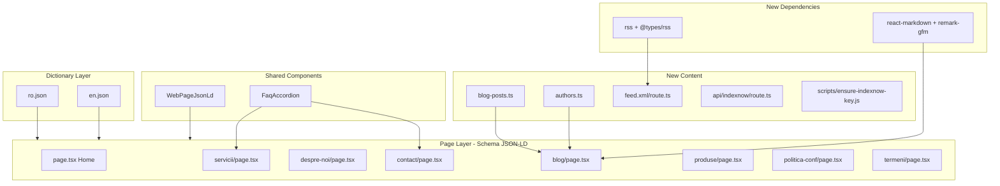
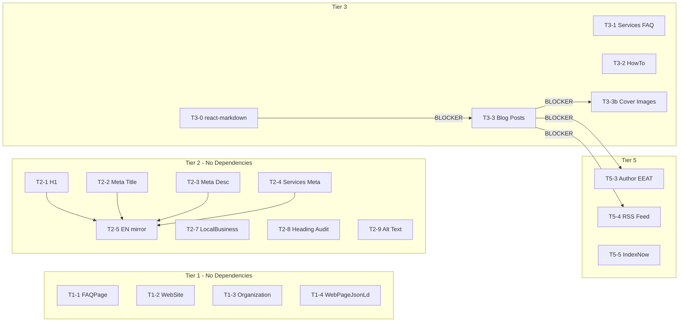

# SEO & GEO EPR Full Execution Plan (Deepened)

## Enhancement Summary

**Deepened on:** 2026-03-04
**Research areas:** JSON-LD schema patterns, RSS feed implementation, IndexNow integration, markdown renderer selection, blog content strategy
**Key improvements added:**

1. Exact approved texts for all meta changes (homeH1, homeTitle, homeDescription, services.metaTitle)
2. Full FAQ content (questions + answers) for Services page in both RO and EN
3. Detailed blog post outlines with H2 structure, FAQ sections, and word count targets
4. Concrete code for WebPageJsonLd, RSS feed, IndexNow, and markdown renderer
5. Author data (Gabriel Ciuca-Albu) with bio and Person schema
6. Parallelization structure -- tasks grouped into independent work streams for subagents
7. Dependency graph showing blockers between tasks
8. XSS sanitization requirement for all JSON-LD output

## Confirmed Decisions (from user)


| Decision          | Answer                                                                                                |
| ----------------- | ----------------------------------------------------------------------------------------------------- |
| Author            | Gabriel Ciuca-Albu, Fondator & CTO                                                                    |
| LinkedIn          | [https://www.linkedin.com/company/rammer-tech/](https://www.linkedin.com/company/rammer-tech/)        |
| Blog tone         | Profesional dar FOARTE accesibil -- fara jargon excesiv, explicatii clare pentru manageri non-tehnici |
| Blog content      | Continut complet generat (1000-1500 cuvinte) -- utilizatorul revizuieste si editeaza                  |
| Markdown renderer | react-markdown + remark-gfm (decizie bazata pe cercetare)                                             |
| Meta texts        | APROBATE -- cu regula diacritice (vezi sectiunea Diacritics Policy)                                   |
| Diacritics policy | FARA diacritice in title/description (SERP). CU diacritice in H1, body, schema, blog (E-E-A-T).       |
| IndexNow trigger  | La fiecare deploy pe Vercel (deploy hook / build script)                                              |
| Author page       | NU -- doar byline + bio scurt la finalul fiecarui articol                                             |
| Cover images      | Generate OG images (1200x630) per articol                                                             |
| Execution scope   | Plan structurat pentru paralelizare la subagenti; utilizatorul declanseaza executia                   |


---

## Diacritics Policy (Romanian Content)

All subagents MUST follow this rule when writing Romanian text:


| Element                                      | Diacritics? | Reason                                                                                                                                                              |
| -------------------------------------------- | ----------- | ------------------------------------------------------------------------------------------------------------------------------------------------------------------- |
| `<title>` tag (meta title)                   | **NO**      | Users search without diacritics ("dezvoltare software bucuresti"). Bing does better exact-match without them. Google normalizes both forms but Bing doesn't always. |
| `<meta description>`                         | **NO**      | Displayed in SERPs -- should match user search patterns for higher CTR and Bing exact-match.                                                                        |
| `<h1>`, `<h2>`, body text                    | **YES**     | Visible to users -- proper Romanian signals quality, professionalism, and E-E-A-T. Google uses on-page content for quality signals.                                 |
| Schema JSON-LD (`name`, `description`, etc.) | **YES**     | Fed to AI engines (Google AI Overviews, Bing Copilot, Perplexity). Correct Romanian improves entity recognition and citation quality.                               |
| Blog post content                            | **YES**     | Visible content, E-E-A-T, AI citation quality.                                                                                                                      |
| FAQ questions & answers                      | **YES**     | Visible content + schema. Proper Romanian in FAQ improves snippet quality.                                                                                          |
| URL slugs                                    | **NO**      | URLs must be ASCII-safe. Already the case in the codebase.                                                                                                          |
| Open Graph `og:title` / `og:description`     | **NO**      | Mirrors title/description for consistency in social sharing.                                                                                                        |


**Summary rule:** If the text appears in SERPs or URLs, strip diacritics. If the text is visible on the page or consumed by AI engines via schema, keep diacritics.

**Shared utility:** Create `src/lib/strip-diacritics.ts` for cases where a single source string (e.g. blog `title`) is used in both visible and SERP contexts:

```typescript
export function stripDiacritics(text: string): string {
  return text.normalize("NFD").replace(/[\u0300-\u036f]/g, "");
}
```

Usage in `generateMetadata`: `title: stripDiacritics(post.title)`. This allows blog post `title` to be stored with diacritics (for H1 rendering) while the `<title>` tag gets the stripped version.

---

## Architecture Overview




## Dependency Graph




## Parallelization Structure

Tasks are grouped into independent work streams that can run as parallel subagents:

### Stream A: Schema & Structured Data (T1-1, T1-2, T1-3, T1-4, T2-7)

Files touched: `page.tsx` (home), `despre-noi/page.tsx`, `contact/page.tsx`, `servicii/page.tsx`, `blog/page.tsx`, `produse/page.tsx`, `politica-conf/page.tsx`, `termeni/page.tsx`, NEW `web-page-json-ld.tsx`

### Stream B: Dictionary Text Optimization (T2-1, T2-2, T2-3, T2-4, T2-5, T3-1)

Files touched: `ro.json`, `en.json`

### Stream C: Blog Infrastructure (T3-0, T4-5)

Files touched: `blog/[slug]/page.tsx`, `package.json` (new deps)

### Stream D: Blog Content Creation (T3-3, T3-3b) -- depends on Stream C

Files touched: `blog-posts.ts`, `public/blog/` (cover images)

### Stream E: Audits (T2-8, T2-9, T2-10, T4-3)

Read-only analysis, then targeted fixes

### Stream F: Content SEO Infrastructure (T5-3, T5-4, T5-5)

Files touched: NEW `authors.ts`, NEW `feed.xml/route.ts`, NEW `api/indexnow/route.ts`, NEW `scripts/ensure-indexnow-key.js`, `layout.tsx` (RSS alternate), `blog/[slug]/page.tsx` (author bio)

---

## TIER 1 -- Critical Foundation (Day 1)

### T1-1: Activate FAQPage schema on Contact page

**File:** [src/app/[lang]/contact/page.tsx](src/app/[lang]/contact/page.tsx)

**Exact change** at line 74:

```tsx
// BEFORE
<FaqAccordion items={dict.contact.faq.items} />

// AFTER
<FaqAccordion items={dict.contact.faq.items} schema />
```

The `FaqAccordion` component at [src/components/faq-accordion.tsx](src/components/faq-accordion.tsx) already supports `schema` prop and generates valid FAQPage JSON-LD when `schema={true}`.

**Research insight:** Google restricted FAQPage rich results to government/health sites in Aug 2023. However, FAQPage schema remains highly valuable for AI Overviews -- pages with FAQPage schema are 3.2x more likely to be cited in Google AI Overviews (Source: schemavalidator.org). It also helps Bing Copilot extract Q&A content.

**Why:** AI Overview eligibility. Ref: [https://developers.google.com/search/docs/appearance/structured-data/faqpage](https://developers.google.com/search/docs/appearance/structured-data/faqpage)

---

### T1-2: Add WebSite JSON-LD to homepage

**File:** [src/app/[lang]/page.tsx](src/app/[lang]/page.tsx)

Add a second `<script type="application/ld+json">` block after the existing Organization schema (after line 100, before `</>`).

**Exact JSON-LD to add:**

```json
{
  "@context": "https://schema.org",
  "@type": "WebSite",
  "name": "Rammer Tech",
  "url": "https://www.rammertech.ro",
  "inLanguage": "ro",
  "publisher": {
    "@type": "Organization",
    "name": "Rammer Tech"
  }
}
```

**Implementation note:** No `SearchAction` because the site has no search functionality. Multiple `<script type="application/ld+json">` blocks on one page are valid -- Google merges them into a single graph.

**XSS sanitization:** All JSON-LD output must use `.replace(/</g, '\\u003c')` on the stringified JSON to prevent script injection. Apply this to ALL existing and new schema blocks.

**Why:** Declares canonical site identity. Ref: [https://schema.org/WebSite](https://schema.org/WebSite)

---

### T1-3: Complete Organization schema on homepage + About page

**File 1:** [src/app/[lang]/page.tsx](src/app/[lang]/page.tsx) (lines 80-100)

**Replace** the existing Organization JSON-LD with:

```json
{
  "@context": "https://schema.org",
  "@type": "Organization",
  "name": "Rammer Tech",
  "url": "https://www.rammertech.ro",
  "logo": "https://www.rammertech.ro/Rammer%20Tech%20LOGO.png",
  "description": "Dezvoltam aplicatii web si mobile de ultima generatie si sisteme enterprise personalizate. Partenerul tau de incredere in transformarea digitala.",
  "foundingDate": "2025",
  "address": {
    "@type": "PostalAddress",
    "addressLocality": "București",
    "addressRegion": "București",
    "addressCountry": "RO"
  },
  "contactPoint": {
    "@type": "ContactPoint",
    "contactType": "customer service",
    "email": "office@mail.rammertech.ro",
    "telephone": "+40736459926",
    "availableLanguage": ["Romanian"]
  },
  "sameAs": [
    "https://www.linkedin.com/company/rammer-tech/"
  ]
}
```

**Note:** `description` uses `dict.hero.subtitle` value. `telephone` comes from `dict.contact.info.phone`. `sameAs` now includes the confirmed LinkedIn URL.

**File 2:** [src/app/[lang]/despre-noi/page.tsx](src/app/[lang]/despre-noi/page.tsx) (lines 169-176)

**Replace** the minimal Organization schema with the same complete version as above (use `about.hero.subtitle` for description).

---

### T1-4: Create WebPageJsonLd component + add to all 8 pages

**New file:** `src/components/web-page-json-ld.tsx`

```tsx
const SITE_URL =
  process.env.NEXT_PUBLIC_SITE_URL ?? "https://www.rammertech.ro";

interface WebPageJsonLdProps {
  name: string;
  description: string;
  url: string;
  datePublished?: string;
  dateModified?: string;
  inLanguage?: string;
}

export function WebPageJsonLd({
  name,
  description,
  url,
  datePublished = "2025-05-30",
  dateModified = "2026-03-04",
  inLanguage = "ro",
}: WebPageJsonLdProps) {
  const jsonLd = {
    "@context": "https://schema.org",
    "@type": "WebPage",
    name,
    description,
    url,
    datePublished,
    dateModified,
    inLanguage,
    isPartOf: {
      "@type": "WebSite",
      url: SITE_URL,
    },
  };

  return (
    <script
      type="application/ld+json"
      dangerouslySetInnerHTML={{
        __html: JSON.stringify(jsonLd).replace(/</g, "\\u003c"),
      }}
    />
  );
}
```

**Date strategy (from research):** Use per-page constants. `datePublished: "2025-05-30"` (domain registration date). `dateModified: "2026-03-04"` (current date). Only update `dateModified` when substantive content changes occur -- fake freshness is penalized by Google's December 2025 Core Update.

**Add to each page** -- import and render before the closing `</>`:


| Page file                | `name`                         | `description`                        | `url`                                       |
| ------------------------ | ------------------------------ | ------------------------------------ | ------------------------------------------- |
| `page.tsx` (Home)        | `dict.meta.homeTitle`          | `dict.meta.homeDescription`          | `${SITE_URL}/ro`                            |
| `servicii/page.tsx`      | `dict.services.metaTitle`      | `dict.services.metaDescription`      | `${SITE_URL}/ro/servicii`                   |
| `despre-noi/page.tsx`    | `dict.about.metaTitle`         | `dict.about.metaDescription`         | `${SITE_URL}/ro/despre-noi`                 |
| `contact/page.tsx`       | `dict.contact.metaTitle`       | `dict.contact.metaDescription`       | `${SITE_URL}/ro/contact`                    |
| `blog/page.tsx`          | `dict.blog.metaTitle`          | `dict.blog.metaDescription`          | `${SITE_URL}/ro/blog`                       |
| `produse/page.tsx`       | `dict.products.metaTitle`      | `dict.products.metaDescription`      | `${SITE_URL}/ro/produse`                    |
| `politica-conf/page.tsx` | `dict.legal.privacy.metaTitle` | `dict.legal.privacy.metaDescription` | `${SITE_URL}/ro/politica-confidentialitate` |
| `termeni/page.tsx`       | `dict.legal.terms.metaTitle`   | `dict.legal.terms.metaDescription`   | `${SITE_URL}/ro/termeni-si-conditii`        |


**Also add `metaDescription` to legal sections in dictionaries (NO diacritics -- SERP display):**

In `ro.json`:

```json
"privacy": {
  "metaTitle": "Politica de Confidentialitate | Rammer Tech",
  "metaDescription": "Politica de confidentialitate Rammer Tech: cum colectam, folosim si protejam datele tale personale conform GDPR.",
  ...
}
"terms": {
  "metaTitle": "Termeni si Conditii | Rammer Tech",
  "metaDescription": "Termenii si conditiile de utilizare a site-ului Rammer Tech. Informatii despre servicii, proprietate intelectuala si legislatia aplicabila.",
  ...
}
```

In `en.json`:

```json
"privacy": {
  "metaTitle": "Privacy Policy | Rammer Tech",
  "metaDescription": "Rammer Tech privacy policy: how we collect, use, and protect your personal data in compliance with GDPR.",
  ...
}
"terms": {
  "metaTitle": "Terms & Conditions | Rammer Tech",
  "metaDescription": "Terms and conditions for using the Rammer Tech website. Information about services, intellectual property, and applicable law.",
  ...
}
```

---

### T1-5 / T1-6: robots.txt and HTTPS verification

No code changes needed. Both are already correct:

- [src/app/robots.ts](src/app/robots.ts): allows `/`, disallows `/api/`, includes sitemap URL
- HTTPS enforced by Vercel + `NEXT_PUBLIC_SITE_URL` uses `https://`

---

### T1-7: Bing Webmaster Tools (MANUAL USER ACTION)

User must:

1. Go to [https://www.bing.com/webmasters/](https://www.bing.com/webmasters/)
2. Verify ownership of `https://www.rammertech.ro`
3. Submit sitemap URL: `https://www.rammertech.ro/sitemap.xml`

---

### T1-8: SSG HTML verification

No code changes. Next.js SSG with `generateStaticParams` pre-renders full HTML. Bingbot can read content without JS execution.

---

## TIER 2 -- Performance & On-Page (Week 1)

### T2-1: Optimize homepage H1 (APPROVED -- WITH diacritics, visible to users)

**File:** [src/dictionaries/ro.json](src/dictionaries/ro.json) line 7

```
BEFORE: "homeH1": "Soluții Tehnologice Inovatoare de la Rammer Tech"
AFTER:  "homeH1": "Dezvoltare Software și Soluții IT pentru Afaceri în București"
```

Contains: "dezvoltare software" (primary keyword) + "București" (local) + "soluții IT" (secondary). H1 uses diacritics because it is visible page content -- proper Romanian signals quality and professionalism (E-E-A-T).

---

### T2-2: Optimize homepage meta title (APPROVED -- WITHOUT diacritics, SERP display)

**File:** [src/dictionaries/ro.json](src/dictionaries/ro.json) line 5

```
BEFORE: "homeTitle": "Rammer Tech | Servicii IT și Soluții Software București"
AFTER:  "homeTitle": "Dezvoltare Software Bucuresti — Servicii IT & Solutii Custom | Rammer Tech"
```

No diacritics in title tag -- matches how Romanian users type in Google/Bing. Google normalizes diacritics for matching, but Bing does better exact-match with the form users actually search. Character count: ~67 chars.

---

### T2-3: Optimize homepage meta description (APPROVED -- WITHOUT diacritics, SERP display)

**File:** [src/dictionaries/ro.json](src/dictionaries/ro.json) line 6

```
BEFORE: "homeDescription": "Rammer Tech oferă servicii IT, dezvoltare software personalizată și soluții enterprise în București. Aplicații web și mobile, consultanță și transformare digitală."
AFTER:  "homeDescription": "Rammer Tech ofera dezvoltare software personalizata, aplicatii web si mobile, sisteme ERP/CRM si consultanta IT in Bucuresti. Partenerul tau de incredere pentru transformare digitala."
```

No diacritics in meta description -- this appears in SERPs and should match how users search. Character count: ~160 chars. Includes ERP/CRM keywords.

---

### T2-4: Optimize Services meta title (APPROVED -- WITHOUT diacritics, SERP display)

**File:** [src/dictionaries/ro.json](src/dictionaries/ro.json) line 87

```
BEFORE: "metaTitle": "Servicii Software -- Dezvoltare Web, Mobile, Enterprise | Rammer Tech"
AFTER:  "metaTitle": "Servicii Software Bucuresti — Dezvoltare Web, Mobile & Enterprise | Rammer Tech"
```

No diacritics -- SERP display. Adds "Bucuresti" for Bing exact-match.

---

### T2-5: Mirror all meta changes in en.json

**File:** [src/dictionaries/en.json](src/dictionaries/en.json)

Add to `meta` object (currently only has `siteName` and `titleSuffix`):

```json
"meta": {
  "siteName": "Rammer Tech",
  "titleSuffix": " | Rammer Tech",
  "homeTitle": "Software Development Bucharest — IT Services & Custom Solutions | Rammer Tech",
  "homeDescription": "Rammer Tech offers custom software development, web and mobile apps, ERP/CRM systems, and IT consulting in Bucharest. Your trusted partner for digital transformation.",
  "homeH1": "Software Development and IT Solutions for Businesses in Bucharest"
}
```

Update `services.metaTitle`:

```
BEFORE: "metaTitle": "Software Services -- Web, Mobile, Enterprise Development | Rammer Tech"
AFTER:  "metaTitle": "Software Services Bucharest — Web, Mobile & Enterprise Development | Rammer Tech"
```

---

### T2-6: OG image verification

Verify `public/og-default.png` exists and is 1200x630px. The file exists (17982 lines when base64 encoded). Check actual dimensions:

```bash
file public/og-default.png
# or
identify public/og-default.png
```

If dimensions are wrong, resize to exactly 1200x630px. This is critical for Bing social signal ranking (OG image is a direct Bing ranking input).

---

### T2-7: Complete LocalBusiness schema on Contact page

**File:** [src/app/[lang]/contact/page.tsx](src/app/[lang]/contact/page.tsx) (lines 76-95)

**Replace** the existing ContactPage + LocalBusiness schema with:

```json
{
  "@context": "https://schema.org",
  "@type": "ContactPage",
  "mainEntity": {
    "@type": "LocalBusiness",
    "name": "Rammer Tech",
    "email": "office@mail.rammertech.ro",
    "telephone": "+40736459926",
    "url": "https://www.rammertech.ro",
    "image": "https://www.rammertech.ro/Rammer%20Tech%20LOGO.png",
    "address": {
      "@type": "PostalAddress",
      "addressLocality": "București",
      "addressRegion": "București",
      "addressCountry": "RO"
    },
    "openingHoursSpecification": {
      "@type": "OpeningHoursSpecification",
      "dayOfWeek": ["Monday", "Tuesday", "Wednesday", "Thursday", "Friday"],
      "opens": "09:00",
      "closes": "18:00"
    },
    "sameAs": [
      "https://www.linkedin.com/company/rammer-tech/"
    ]
  }
}
```

---

### T2-8: Heading audit

Verify each page has exactly one `<h1>` and correct H2/H3 hierarchy. Check these components for duplicate H1 tags:

- `HeroSection` component (used on Home)
- `ServicesHero` component (used on Servicii)
- `ContactHero` component (used on Contact)

Pages to verify:

- **Home**: H1 from `dict.meta.homeH1` via HeroSection
- **Servicii**: H1 from ServicesHero. H2s from ServiceDetailCard titles + WorkflowTimeline title
- **Despre Noi**: H1 at line 67. H2s for story, mission, vision, values, differentiators
- **Contact**: H1 from ContactHero. H2 for FAQ title
- **Blog**: H1 at line 49
- **Produse**: H1 at line 67. H2 at line 82
- **Legal pages**: H1 from LegalPageLayout line 54. H2s from sections

---

### T2-9: Image alt text audit

Search all `` and `<Image>` components. Verify each has descriptive `alt` under 125 chars. Fix any missing or generic alt text.

---

### T2-10: Bing exact-match keyword audit

For each key page, verify the primary keyword appears verbatim in: title, H1, first paragraph, URL slug, meta description.

**IMPORTANT -- Diacritics rule for Bing exact-match:** Keywords in title and meta description MUST be without diacritics (e.g. "Bucuresti" not "București") to match how users search. Keywords in H1 and first paragraph use diacritics (visible content). This means the "exact match" check for title/description uses the non-diacritical form.


| Page       | Primary keyword (title/desc form)   | Primary keyword (H1/body form)      | Check locations                       |
| ---------- | ----------------------------------- | ----------------------------------- | ------------------------------------- |
| Home       | "dezvoltare software" + "Bucuresti" | "dezvoltare software" + "București" | title, H1, description, hero subtitle |
| Servicii   | "servicii software" + "Bucuresti"   | "servicii software" + "București"   | title, H1, description                |
| Contact    | "contact"                           | "contact"                           | title, URL slug                       |
| Despre Noi | "echipa" or "despre noi"            | "echipa" or "despre noi"            | title, H1                             |


After T2-1/T2-2/T2-3/T2-4 changes, re-verify that hero subtitle (`dict.hero.subtitle`) also contains "dezvoltare" or "software". Current subtitle: "Dezvoltam aplicatii web si mobile..." -- contains "dezvoltam" which is a verb form of "dezvoltare". Acceptable for Google (semantic match) but Bing prefers exact noun form. Consider updating `hero.subtitle` if needed.

---

## TIER 3 -- Content & Authority (Week 2-3)

### T3-0: Install react-markdown + remark-gfm (BLOCKER for T3-3)

**Decision rationale (from research):** react-markdown + remark-gfm is the industry standard for SEO-optimized Next.js blogs with TS-stored markdown content. It produces clean semantic HTML (`<table>`, `<ol>`, `<strong>`, `<a>`), works in Server Components (no client JS for content rendering), and handles edge cases (escaping, nesting) that a custom parser cannot.

**Install:**

```bash
pnpm add react-markdown remark-gfm
```

**Replace** the custom `renderContent` function in [src/app/[lang]/blog/[slug]/page.tsx](src/app/[lang]/blog/[slug]/page.tsx) (lines 57-84) with:

```tsx
import Markdown from "react-markdown";
import remarkGfm from "remark-gfm";

// In the component, replace {renderContent(post.content)} with:
<Markdown
  remarkPlugins={[remarkGfm]}
  components={{
    h2: ({ children }) => (
      <h2 className="text-2xl font-bold mt-8 mb-4">{children}</h2>
    ),
    p: ({ children }) => (
      <p className="text-muted-foreground leading-relaxed mb-4">{children}</p>
    ),
    ul: ({ children }) => (
      <ul className="list-disc list-inside space-y-1 mb-4">{children}</ul>
    ),
    ol: ({ children }) => (
      <ol className="list-decimal list-inside space-y-1 mb-4">{children}</ol>
    ),
    li: ({ children }) => (
      <li className="text-muted-foreground">{children}</li>
    ),
    table: ({ children }) => (
      <div className="overflow-x-auto mb-4">
        <table className="w-full border-collapse border border-border text-sm">
          {children}
        </table>
      </div>
    ),
    th: ({ children }) => (
      <th className="border border-border bg-muted px-3 py-2 text-left font-semibold">
        {children}
      </th>
    ),
    td: ({ children }) => (
      <td className="border border-border px-3 py-2">{children}</td>
    ),
    a: ({ href, children }) => (
      <a
        href={href}
        className="text-primary underline hover:text-primary/80"
        target={href?.startsWith("http") ? "_blank" : undefined}
        rel={href?.startsWith("http") ? "noopener noreferrer" : undefined}
      >
        {children}
      </a>
    ),
    strong: ({ children }) => (
      <strong className="font-semibold text-foreground">{children}</strong>
    ),
  }}
>
  {post.content}
</Markdown>
```

Delete the old `renderContent` function (lines 57-84).

---

### T3-1: Add FAQ section with FAQPage schema to Services page

**Files to modify:**

1. **[src/dictionaries/ro.json](src/dictionaries/ro.json)** -- add `services.faq` after `services.ctaBanner`:

```json
"faq": {
  "title": "Întrebări Frecvente despre Serviciile Noastre",
  "items": [
    {
      "question": "Cât costă dezvoltarea unei aplicații web personalizate?",
      "answer": "Costul variază în funcție de complexitate: aplicațiile simple pornesc de la 3.000-5.000 EUR, cele de complexitate medie între 5.000-20.000 EUR, iar sistemele enterprise complexe pot depăși 30.000 EUR. Oferim consultanță gratuită pentru estimarea bugetului proiectului tău."
    },
    {
      "question": "Cât durează un proiect de dezvoltare software?",
      "answer": "Un MVP sau o aplicație simplă durează 4-8 săptămâni. Proiectele de complexitate medie necesită 2-4 luni, iar sistemele enterprise complexe (ERP, CRM) pot dura 4-8 luni. Folosim metodologie agilă cu livrări incrementale, astfel încât vezi progres din primele săptămâni."
    },
    {
      "question": "Ce tehnologii folosiți pentru dezvoltare?",
      "answer": "Folosim un stack modern: React și Next.js pentru frontend, Node.js și TypeScript pentru backend, PostgreSQL și MongoDB pentru baze de date, și platforme cloud precum AWS și Vercel pentru hosting. Alegem tehnologiile potrivite pentru fiecare proiect în parte."
    },
    {
      "question": "Oferiți suport și mentenanță după lansare?",
      "answer": "Da. Fiecare proiect include o perioadă de suport post-lansare. Oferim și pachete de mentenanță continuă care includ monitorizare, actualizări de securitate, optimizări de performanță și implementarea de funcționalități noi."
    },
    {
      "question": "Cum funcționează procesul de colaborare?",
      "answer": "Procesul nostru are 6 etape: descoperire (înțelegem nevoile), planificare (definim arhitectura și bugetul), dezvoltare (iterații agile cu feedback), testare (QA riguros), lansare (deployment) și suport continuu. Comunicăm transparent prin ședințe regulate de status."
    }
  ]
}
```

1. **[src/dictionaries/en.json](src/dictionaries/en.json)** -- mirror:

```json
"faq": {
  "title": "Frequently Asked Questions About Our Services",
  "items": [
    {
      "question": "How much does custom web application development cost?",
      "answer": "Costs vary by complexity: simple applications start from 3,000-5,000 EUR, medium complexity projects range from 5,000-20,000 EUR, and complex enterprise systems can exceed 30,000 EUR. We offer free consultations to estimate your project budget."
    },
    {
      "question": "How long does a software development project take?",
      "answer": "An MVP or simple application takes 4-8 weeks. Medium complexity projects require 2-4 months, while complex enterprise systems (ERP, CRM) can take 4-8 months. We use agile methodology with incremental deliveries, so you see progress from the first weeks."
    },
    {
      "question": "What technologies do you use for development?",
      "answer": "We use a modern stack: React and Next.js for frontend, Node.js and TypeScript for backend, PostgreSQL and MongoDB for databases, and cloud platforms like AWS and Vercel for hosting. We choose the right technologies for each project."
    },
    {
      "question": "Do you offer support and maintenance after launch?",
      "answer": "Yes. Every project includes a post-launch support period. We also offer ongoing maintenance packages that include monitoring, security updates, performance optimizations, and implementation of new features."
    },
    {
      "question": "How does the collaboration process work?",
      "answer": "Our process has 6 stages: discovery (understanding needs), planning (defining architecture and budget), development (agile iterations with feedback), testing (rigorous QA), launch (deployment), and ongoing support. We communicate transparently through regular status meetings."
    }
  ]
}
```

1. **[src/app/[lang]/servicii/page.tsx](src/app/[lang]/servicii/page.tsx)** -- add FAQ section before the CTA banner (before line 66):

```tsx
import { FaqAccordion } from "@/components/faq-accordion";

// Add before <CtaBanner>:
<section className="py-16 px-6 bg-muted/50">
  <div className="container mx-auto max-w-3xl">
    <h2 className="text-2xl font-bold mb-8 text-center">
      {dict.services.faq.title}
    </h2>
    <FaqAccordion items={dict.services.faq.items} schema />
  </div>
</section>
```

---

### T3-2: Add HowTo JSON-LD to Services workflow section

**File:** [src/app/[lang]/servicii/page.tsx](src/app/[lang]/servicii/page.tsx)

Add after the WorkflowTimeline component (after line 64):

```tsx
<script
  type="application/ld+json"
  dangerouslySetInnerHTML={{
    __html: JSON.stringify({
      "@context": "https://schema.org",
      "@type": "HowTo",
      name: dict.services.workflow.title,
      description: "Cum dezvoltăm software personalizat: de la descoperire la suport continuu.",
      totalTime: "PT12W",
      step: dict.services.workflow.steps.map(
        (step: { title: string; description: string }, idx: number) => ({
          "@type": "HowToStep",
          position: idx + 1,
          name: step.title,
          text: step.description,
        })
      ),
    }).replace(/</g, "\\u003c"),
  }}
/>
```

**Research insight:** Google removed HowTo rich results from SERPs in Aug-Sep 2023. However, HowTo schema remains valuable for AI Overviews -- it makes each step independently extractable by AI engines. Still recommended for AI search visibility.

---

### T3-3: Create first 3 blog posts

**File:** [src/data/blog-posts.ts](src/data/blog-posts.ts)

**DEPENDS ON:** T3-0 (react-markdown must be installed first, because content uses GFM tables and ordered lists)

**Author for all posts:** `"Gabriel Ciucă-Albu"`

**Diacritics in blog posts:** Blog post `title` uses diacritics (it renders as the visible H1). The `generateMetadata` function in `blog/[slug]/page.tsx` must strip diacritics when building the `<title>` tag and `og:title`. Add a shared `stripDiacritics()` utility (see Diacritics Policy section). The `excerpt` field (used as meta description) should be stored WITHOUT diacritics since it maps to `<meta description>` and `og:description`.

**Blog tone:** Profesional dar FOARTE accesibil -- fara jargon excesiv, explicatii clare pentru manageri non-tehnici. Scrie ca si cum explici unui prieten care conduce un business si vrea sa inteleaga ce implica software-ul custom.

**Content length target:** 1000-1500 cuvinte per articol.

**Markdown format:** GFM (GitHub Flavored Markdown) -- use `##`  for H2, `###`  for H3, `| col | col |` for tables, `1.`  for ordered lists, `-`  for unordered lists, `**bold`**, `[text](url)` for links.

**Internal links required in each post:**

- Link to `/ro/servicii` (pillar page) with descriptive anchor text
- Link to `/ro/contact` with CTA anchor text
- Link to 1-2 other blog posts (when they exist)

**Citation links required:** Each post must link to 2-3 authoritative external sources.

---

#### Article 1: "Cum alegi o firmă de dezvoltare software în București: 7 criterii esențiale"

```
slug: "cum-alegi-firma-dezvoltare-software-bucuresti"
category: "consulting"
date: "2026-03-04"
author: "Gabriel Ciucă-Albu"
readingTime: 7
coverImage: "/blog/cum-alegi-firma-software.png"
title: "Cum alegi o firmă de dezvoltare software în București: 7 criterii esențiale"
excerpt: "Ghid practic pentru alegerea unei firme de software in Bucuresti. 7 criterii verificate: experienta, stack tehnic, comunicare, portofoliu, pret, suport si referinte."
```

**H2 Outline:**

1. **Intro (40-60 cuvinte):** Răspuns direct -- "Alegerea unei firme de dezvoltare software depinde de 7 factori cheie: experiența în domeniul tău, stack-ul tehnic, transparența comunicării, portofoliul relevant, raportul calitate-preț, suportul post-lansare și referințele verificabile."
2. **H2: De ce contează alegerea firmei de software** -- consecințele unei alegeri greșite (bani pierduți, timp pierdut, proiect eșuat)
3. **H2: 1. Experiența relevantă în domeniul tău** -- nu doar ani, ci proiecte similare
4. **H2: 2. Stack-ul tehnic și competențele echipei** -- ce tehnologii sunt potrivite, cum verifici
5. **H2: 3. Transparența în comunicare și proces** -- red flags, green flags
6. **H2: 4. Portofoliul și studiile de caz** -- ce să cauți, cum evaluezi
7. **H2: 5. Raportul calitate-preț** -- de ce cel mai ieftin nu e cel mai bun, range-uri orientative
8. **H2: 6. Suportul și mentenanța post-lansare** -- ce include, de ce e critic
9. **H2: 7. Referințele și recenziile verificabile** -- cum verifici
10. **H2: Întrebări frecvente** -- 3 FAQ-uri (Q&A format, 2-4 propoziții fiecare):
  - "Cât ar trebui să bugetez pentru un proiect software?"
    - "Cât durează de obicei un proiect de dezvoltare?"
    - "Pot colabora la distanță cu o firmă din București?"
11. **Concluzie** -- rezumat + CTA link spre `/ro/contact`

**External citations:** Link to Google's guide on choosing vendors, relevant Romanian business statistics.

---

#### Article 2: "Cât costă o aplicație web personalizată în România? Ghid complet 2026"

```
slug: "cat-costa-aplicatie-web-personalizata-romania"
category: "software"
date: "2026-03-04"
author: "Gabriel Ciucă-Albu"
readingTime: 8
coverImage: "/blog/cat-costa-aplicatie-web.png"
title: "Cât costă o aplicație web personalizată în România? Ghid complet 2026"
excerpt: "Costurile reale ale dezvoltarii unei aplicatii web custom in Romania: de la 3.000 EUR pentru un MVP la peste 50.000 EUR pentru sisteme enterprise. Factori, exemple si sfaturi."
```

**H2 Outline:**

1. **Intro (40-60 cuvinte):** "O aplicație web personalizată în România costă între 3.000 și 50.000+ EUR, în funcție de complexitate. Un MVP simplu pornește de la 3.000-5.000 EUR, o aplicație de business de la 10.000-25.000 EUR, iar un sistem enterprise complex poate depăși 50.000 EUR."
2. **H2: Intervalele de preț pe categorii de complexitate** -- tabel GFM cu 4 categorii (simplu, mediu, complex, enterprise), range preț, exemple, durată
3. **H2: Factorii care influențează costul** -- design, funcționalități, integrări, securitate
4. **H2: Costul pe componente** -- frontend, backend, baze de date, hosting, testare
5. **H2: De ce variază prețurile între firme** -- experiență, locație, overhead, calitate
6. **H2: Cum să economisești fără să compromiți calitatea** -- MVP first, prioritizare features, comunicare clară
7. **H2: Costuri ascunse de care trebuie să ții cont** -- mentenanță, hosting, actualizări, scalare
8. **H2: Întrebări frecvente** -- 3 FAQ-uri:
  - "Pot obține o aplicație web bună sub 5.000 EUR?"
    - "Ce include prețul unei aplicații web?"
    - "Cât costă mentenanța lunară?"
9. **Concluzie** -- CTA link spre `/ro/contact`

**Table (GFM format for react-markdown):**

```markdown
| Tip aplicație | Preț orientativ | Durată | Exemple |
|---|---|---|---|
| MVP / Landing page | 3.000 - 5.000 EUR | 2-4 săptămâni | Site prezentare, formular contact |
| Aplicație medie | 5.000 - 20.000 EUR | 1-3 luni | Dashboard, portal clienți |
| Aplicație complexă | 20.000 - 50.000 EUR | 3-6 luni | Platformă multi-user, e-commerce |
| Sistem enterprise | 50.000+ EUR | 6-12 luni | ERP, CRM, BI platform |
```

---

#### Article 3: "ERP custom vs. ERP off-the-shelf: ce alegi pentru IMM-ul tău?"

```
slug: "erp-custom-vs-off-the-shelf-imm"
category: "software"
date: "2026-03-04"
author: "Gabriel Ciucă-Albu"
readingTime: 7
coverImage: "/blog/erp-custom-vs-off-the-shelf.png"
title: "ERP custom vs. ERP off-the-shelf: ce alegi pentru IMM-ul tău?"
excerpt: "Comparatie detaliata intre ERP personalizat si ERP off-the-shelf pentru IMM-uri din Romania. Avantaje, dezavantaje, costuri si criterii de decizie."
```

**H2 Outline:**

1. **Intro (40-60 cuvinte):** "Alegerea între un ERP custom și unul off-the-shelf depinde de specificul afacerii tale. ERP-urile off-the-shelf sunt mai rapide de implementat și mai ieftine inițial, dar ERP-urile custom se potrivesc exact pe procesele tale și sunt mai scalabile pe termen lung."
2. **H2: Ce este un ERP și de ce ai nevoie de unul** -- explicație accesibilă
3. **H2: ERP off-the-shelf: avantaje și dezavantaje** -- tabel pro/contra
4. **H2: ERP custom: avantaje și dezavantaje** -- tabel pro/contra
5. **H2: Comparație directă** -- tabel comparativ GFM (cost inițial, cost lunar, timp implementare, flexibilitate, scalabilitate, suport)
6. **H2: Când să alegi off-the-shelf** -- criterii concrete
7. **H2: Când să alegi custom** -- criterii concrete
8. **H2: Opțiunea hibridă: off-the-shelf cu personalizări** -- middle ground
9. **H2: Întrebări frecvente** -- 3 FAQ-uri:
  - "Cât costă un ERP custom pentru un IMM?"
    - "Pot migra de la un ERP off-the-shelf la unul custom?"
    - "Cât durează implementarea unui ERP custom?"
10. **Concluzie** -- CTA link spre `/ro/servicii` și `/ro/contact`

---

### T3-3b: Generate cover images for blog posts

Generate 3 OG images (1200x630px each) using the image generation tool:

1. `public/blog/cum-alegi-firma-software.png` -- tema: alegere/decizie, software, București
2. `public/blog/cat-costa-aplicatie-web.png` -- tema: costuri, calculator, aplicație web
3. `public/blog/erp-custom-vs-off-the-shelf.png` -- tema: comparație, ERP, business

Style: profesional, clean, brand colors (crimson gradient from brand palette), text minimal pe imagine.

---

### T3-4: Internal link audit

Add in-content cross-links:

- Blog posts link back to `/ro/servicii` (pillar) with descriptive anchor text
- Blog posts link to each other where relevant
- Services page: add link to `/ro/blog` in the intro or after FAQ section
- About page: verify links to `/ro/servicii` and `/ro/contact` exist

---

### T3-5: Content freshness -- dateModified tracking

Handled by `WebPageJsonLd` component (T1-4). Per-page constants. Only update when substantive content changes.

---

### T3-6: Social sharing strategy (MANUAL USER ACTION)

LinkedIn company page already exists: [https://www.linkedin.com/company/rammer-tech/](https://www.linkedin.com/company/rammer-tech/)

User must:

1. Share key pages (Home, Services, Blog posts) on LinkedIn regularly
2. `sameAs` in Organization schema already includes LinkedIn URL (T1-3)

---

## TIER 4 -- GEO / AI Visibility (Week 3-4)

### T4-1: Self-contained H2 answer blocks

Review Services page: each service card (Dezvoltare Web & Mobile, Soluții Enterprise, Consultanță IT) should have H2 headings that fully answer their implied question without depending on other sections.

About page H2 sections (Povestea Noastră, Misiunea, Viziunea) are already self-contained.

Blog posts are written from scratch with self-contained H2 blocks (handled in T3-3).

### T4-2: Definitive answer format in blog posts

Built into T3-3 guidelines: each blog post intro leads with the direct answer in the first 40-60 words (inverted pyramid).

### T4-3: Entity name consistency

Verify "Rammer Tech" appears identically across all schema, meta, OG, and dictionaries. Check for variants: "RammerTech", "Rammer tech", "RAMMER TECH", "rammer tech".

### T4-4: Citation links in blog posts

Built into T3-3 guidelines: each post links to 2-3 authoritative external sources.

### T4-5: Tables and lists in blog posts

Handled by T3-0 (react-markdown + remark-gfm). Blog content uses GFM tables and ordered lists.

---

## TIER 5 -- Content SEO & Blog Optimization (Week 4-5)

### T5-1: Create 2 more blog posts

**File:** [src/data/blog-posts.ts](src/data/blog-posts.ts)

Same guidelines as T3-3 (tone, length, structure, internal links, citations).

#### Article 4: "Transformare digitală pentru IMM-uri: de unde să începi"

```
slug: "transformare-digitala-imm-ghid"
category: "consulting"
date: "2026-03-10"
author: "Gabriel Ciucă-Albu"
readingTime: 7
coverImage: "/blog/transformare-digitala-imm.png"
title: "Transformare digitală pentru IMM-uri: de unde să începi"
excerpt: "Ghid complet de transformare digitala pentru IMM-uri din Romania. Afla de unde sa incepi, cat costa si ce tehnologii sunt esentiale pentru digitalizarea afacerii tale."
```

**H2 Outline:**

1. Intro: direct answer -- "Transformarea digitală începe cu un audit al proceselor existente..."
2. H2: Ce înseamnă transformare digitală pentru un IMM
3. H2: Semnele că afacerea ta are nevoie de digitalizare
4. H2: Primii 5 pași concreți
5. H2: Tehnologii esențiale pentru IMM-uri (CRM, ERP, automatizări)
6. H2: Cât costă și cât durează
7. H2: Greșeli frecvente de evitat
8. H2: FAQ (3 întrebări)
9. Concluzie + CTA

#### Article 5: "Cât durează să construiești o aplicație web? Tot ce trebuie să știi"

```
slug: "cat-dureaza-dezvoltare-aplicatie-web"
category: "software"
date: "2026-03-10"
author: "Gabriel Ciucă-Albu"
readingTime: 6
coverImage: "/blog/cat-dureaza-aplicatie-web.png"
title: "Cât durează să construiești o aplicație web? Tot ce trebuie să știi"
excerpt: "Cat dureaza dezvoltarea unei aplicatii web? De la 4 saptamani pentru un MVP la 12 luni pentru sisteme enterprise. Afla timeline-uri, etape si cum accelerezi procesul."
```

**H2 Outline:**

1. Intro: "O aplicație web durează între 4 săptămâni și 12 luni..."
2. H2: Timeline pe categorii de complexitate (tabel)
3. H2: Factori care influențează durata
4. H2: Etapele dezvoltării și cât durează fiecare
5. H2: Cum să accelerezi procesul fără să compromiți calitatea
6. H2: FAQ (3 întrebări)
7. Concluzie + CTA

---

### T5-2: Pillar-cluster internal linking

Services page = pillar. All 5 blog posts link back to `/ro/servicii` with descriptive anchor text. Blog posts link to 2-3 related blog posts (horizontal links).

---

### T5-3: Author E-E-A-T

**New file:** `src/data/authors.ts`

```typescript
export interface Author {
  slug: string;
  name: string;
  jobTitle: string;
  bio: string;
  linkedIn: string;
}

export const authors: Author[] = [
  {
    slug: "gabriel-ciuca-albu",
    name: "Gabriel Ciucă-Albu",
    jobTitle: "Fondator & CTO",
    bio: "Gabriel este fondatorul și CTO-ul Rammer Tech, cu peste 10 ani de experiență în dezvoltare software. A colaborat cu companii mari precum Creado Concept (grupul ERBAȘU) și PwC, și conduce echipa tehnică a Rammer Tech cu focus pe soluții custom pentru IMM-uri din România.",
    linkedIn: "https://www.linkedin.com/in/gabriel-octavian-ciuca-albu-33a717160/",
  },
];

export function getAuthorByName(name: string): Author | undefined {
  return authors.find((a) => a.name === name);
}
```

**Modify** [src/app/[lang]/blog/[slug]/page.tsx](src/app/[lang]/blog/[slug]/page.tsx):

1. Import `getAuthorByName` from `@/data/authors`
2. Add author bio section after article content (before CTA):

```tsx
const author = getAuthorByName(post.author);

// After article content, before CTA:
{author && (
  <div className="mt-12 pt-8 border-t border-border flex items-start gap-4">
    <div>
      <p className="font-semibold text-foreground">{author.name}</p>
      <p className="text-sm text-muted-foreground">{author.jobTitle}</p>
      <p className="text-sm text-muted-foreground mt-2">{author.bio}</p>
    </div>
  </div>
)}
```

1. Expand Person schema in BlogPosting JSON-LD:

```json
"author": {
  "@type": "Person",
  "name": "Gabriel Ciucă-Albu",
  "jobTitle": "Fondator & CTO",
  "sameAs": ["https://www.linkedin.com/in/gabriel-octavian-ciuca-albu-33a717160/"]
}
```

**No dedicated author page** -- just byline + bio at the end of each article.

---

### T5-4: RSS feed route

**Install:** `pnpm add rss && pnpm add -D @types/rss`

**New file:** `src/app/feed.xml/route.ts`

```typescript
import RSS from "rss";
import { blogPosts } from "@/data/blog-posts";

const SITE_URL =
  process.env.NEXT_PUBLIC_SITE_URL ?? "https://www.rammertech.ro";
const FEED_URL = `${SITE_URL}/feed.xml`;

export const revalidate = 3600;

export async function GET() {
  const feed = new RSS({
    title: "Rammer Tech Blog",
    description:
      "Articole, ghiduri și perspective din lumea software-ului și tehnologiei de la echipa Rammer Tech.",
    site_url: SITE_URL,
    feed_url: FEED_URL,
    language: "ro",
    pubDate: new Date().toUTCString(),
    copyright: `© ${new Date().getFullYear()} Rammer Tech`,
  });

  blogPosts.forEach((post) => {
    feed.item({
      title: post.title,
      description: post.excerpt,
      url: `${SITE_URL}/ro/blog/${post.slug}`,
      guid: `${SITE_URL}/ro/blog/${post.slug}`,
      date: post.date,
      author: post.author,
    });
  });

  let xml = feed.xml({ indent: true });

  xml = xml.replace(
    '<rss version="2.0">',
    '<rss version="2.0" xmlns:atom="http://www.w3.org/2005/Atom">'
  );
  xml = xml.replace(
    "<channel>",
    `<channel>\n    <atom:link href="${FEED_URL}" rel="self" type="application/rss+xml"/>`
  );

  return new Response(xml, {
    headers: {
      "Content-Type": "application/rss+xml; charset=utf-8",
      "Cache-Control":
        "public, max-age=3600, s-maxage=3600, stale-while-revalidate=86400",
    },
  });
}
```

**Also add RSS alternate link to layout metadata:**

In [src/app/[lang]/layout.tsx](src/app/[lang]/layout.tsx), add to the `metadata` export:

```typescript
alternates: {
  types: {
    "application/rss+xml": `${SITE_URL}/feed.xml`,
  },
},
```

**MANUAL USER ACTION:** Submit `https://www.rammertech.ro/feed.xml` to GSC (Sitemaps section) and Bing WT.

---

### T5-5: IndexNow integration

**Env vars needed (add to Vercel):**

- `INDEXNOW_KEY` -- generate with `openssl rand -hex 16`
- `CRON_SECRET` -- for authenticating the API route call

**New file:** `scripts/ensure-indexnow-key.js`

```javascript
const fs = require("fs");
const path = require("path");
const key = process.env.INDEXNOW_KEY;
if (key && /^[a-zA-Z0-9-]{8,128}$/.test(key)) {
  const filePath = path.join(process.cwd(), "public", `${key}.txt`);
  fs.writeFileSync(filePath, key, "utf8");
  console.log(`IndexNow: wrote ${key}.txt to public/`);
} else {
  console.log("IndexNow: INDEXNOW_KEY not set or invalid, skipping key file generation");
}
```

**Update `package.json`** build script:

```json
"build": "node scripts/ensure-indexnow-key.js && next build"
```

**New file:** `src/app/api/indexnow/route.ts`

```typescript
import { NextRequest, NextResponse } from "next/server";

const INDEXNOW_API = "https://api.indexnow.org/indexnow";

export async function POST(request: NextRequest) {
  const secret = request.nextUrl.searchParams.get("secret");
  if (!secret || secret !== process.env.CRON_SECRET) {
    return NextResponse.json({ error: "Unauthorized" }, { status: 401 });
  }

  const key = process.env.INDEXNOW_KEY;
  const siteUrl =
    process.env.NEXT_PUBLIC_SITE_URL ?? "https://www.rammertech.ro";

  if (!key) {
    return NextResponse.json(
      { error: "INDEXNOW_KEY not configured" },
      { status: 500 }
    );
  }

  const host = new URL(siteUrl).hostname;

  const sitemapRes = await fetch(`${siteUrl}/sitemap.xml`, {
    next: { revalidate: 0 },
  });
  if (!sitemapRes.ok) {
    return NextResponse.json(
      { error: "Failed to fetch sitemap" },
      { status: 500 }
    );
  }
  const xml = await sitemapRes.text();
  const urls = [...xml.matchAll(/<loc>([^<]+)<\/loc>/g)].map((m) => m[1]);

  if (urls.length === 0) {
    return NextResponse.json({ submitted: 0 });
  }

  const res = await fetch(INDEXNOW_API, {
    method: "POST",
    headers: { "Content-Type": "application/json; charset=utf-8" },
    body: JSON.stringify({
      host,
      key,
      keyLocation: `${siteUrl}/${key}.txt`,
      urlList: urls,
    }),
  });

  return NextResponse.json({
    submitted: urls.length,
    indexNowStatus: res.status,
  });
}
```

**Trigger on deploy:** Configure Vercel webhook (Deployment Succeeded) to POST to `https://www.rammertech.ro/api/indexnow?secret={CRON_SECRET}`. If Vercel Pro is not available, use GitHub Actions workflow on push to main.

---

## Files Changed Summary


| File                                                 | Tier       | Changes                                                                                                         |
| ---------------------------------------------------- | ---------- | --------------------------------------------------------------------------------------------------------------- |
| `src/dictionaries/ro.json`                           | T1, T2, T3 | Add legal metaDescriptions, optimize homeH1/homeTitle/homeDescription, add services.faq, add services.metaTitle |
| `src/dictionaries/en.json`                           | T1, T2, T3 | Mirror all ro.json changes + add homeTitle/homeDescription/homeH1 to meta                                       |
| `src/app/[lang]/page.tsx`                            | T1         | Complete Organization schema (sameAs, address, telephone), add WebSite schema, add WebPageJsonLd, XSS sanitize  |
| `src/app/[lang]/contact/page.tsx`                    | T1, T2     | Enable FAQPage schema, complete LocalBusiness schema, add WebPageJsonLd                                         |
| `src/app/[lang]/servicii/page.tsx`                   | T1, T3     | Add WebPageJsonLd, add FAQ section with FaqAccordion schema, add HowTo schema                                   |
| `src/app/[lang]/despre-noi/page.tsx`                 | T1         | Complete Organization schema, add WebPageJsonLd                                                                 |
| `src/app/[lang]/blog/page.tsx`                       | T1         | Add WebPageJsonLd                                                                                               |
| `src/app/[lang]/produse/page.tsx`                    | T1         | Add WebPageJsonLd                                                                                               |
| `src/app/[lang]/politica-confidentialitate/page.tsx` | T1         | Add WebPageJsonLd                                                                                               |
| `src/app/[lang]/termeni-si-conditii/page.tsx`        | T1         | Add WebPageJsonLd                                                                                               |
| `src/app/[lang]/blog/[slug]/page.tsx`                | T3, T5     | Replace custom renderer with react-markdown, add author bio, expand Person schema                               |
| `src/app/[lang]/layout.tsx`                          | T5         | Add RSS alternate link to metadata                                                                              |
| `src/components/web-page-json-ld.tsx`                | T1         | **NEW** -- shared WebPage JSON-LD server component                                                              |
| `src/data/blog-posts.ts`                             | T3, T5     | Add 5 blog posts with full markdown content                                                                     |
| `src/data/authors.ts`                                | T5         | **NEW** -- author data with Person schema fields                                                                |
| `src/app/feed.xml/route.ts`                          | T5         | **NEW** -- RSS 2.0 feed route handler                                                                           |
| `src/app/api/indexnow/route.ts`                      | T5         | **NEW** -- IndexNow API ping route                                                                              |
| `scripts/ensure-indexnow-key.js`                     | T5         | **NEW** -- build-time key file generation                                                                       |
| `package.json`                                       | T3, T5     | Add react-markdown, remark-gfm, rss, @types/rss; update build script                                            |


## New Dependencies


| Package          | Version         | Purpose                               |
| ---------------- | --------------- | ------------------------------------- |
| `react-markdown` | latest          | Markdown rendering with semantic HTML |
| `remark-gfm`     | latest          | GFM tables, task lists, strikethrough |
| `rss`            | latest          | RSS 2.0 feed generation               |
| `@types/rss`     | latest (devDep) | TypeScript types for rss package      |


## New Env Vars (Vercel)


| Variable       | Value                  | Purpose                         |
| -------------- | ---------------------- | ------------------------------- |
| `INDEXNOW_KEY` | `openssl rand -hex 16` | IndexNow ownership verification |
| `CRON_SECRET`  | random string          | Authenticate IndexNow API route |


## Manual User Actions


| Action                                         | When                 | Tool                                |
| ---------------------------------------------- | -------------------- | ----------------------------------- |
| Set up Bing Webmaster Tools + submit sitemap   | After Tier 1 deploy  | bing.com/webmasters                 |
| Submit RSS feed URL to GSC + Bing WT           | After Tier 5 deploy  | GSC Sitemaps + Bing WT              |
| Configure Vercel webhook for IndexNow          | After Tier 5 deploy  | Vercel dashboard                    |
| Run Google Rich Results Test                   | After each tier      | search.google.com/test/rich-results |
| Run PageSpeed Insights                         | After Tier 2         | pagespeed.web.dev                   |
| Share key pages on LinkedIn regularly          | Ongoing              | linkedin.com                        |
| Review and edit blog post content              | After T3-3           | Manual review                       |
| Add INDEXNOW_KEY and CRON_SECRET to Vercel env | Before Tier 5 deploy | Vercel dashboard                    |


## Verification Checklist (run after each tier)

- `pnpm build` succeeds without errors
- `pnpm lint` passes
- No TypeScript errors
- Schema blocks validate at [https://validator.schema.org](https://validator.schema.org)
- Rich Results Test shows 0 errors at [https://search.google.com/test/rich-results](https://search.google.com/test/rich-results)
- All pages render correctly in browser
- RSS feed accessible at /feed.xml and returns valid XML

