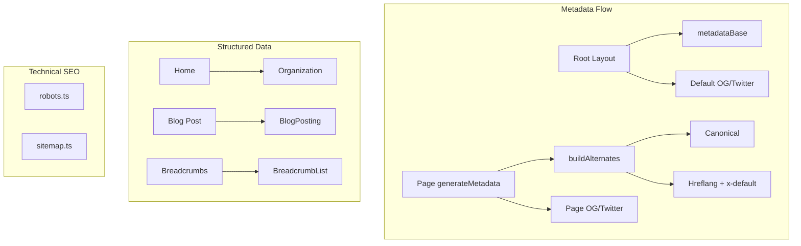

# SEO pentru Next.js – Rammer Tech Landing Site

## 1. Introducere

Acest document este o referință pentru implementarea și verificarea SEO în proiectul Next.js App Router cu i18n (ro/en). Conținutul este extras din analize și conversații despre indexare, metadate și optimizare tehnică.

**Domeniu:** rammertech.ro (www vs non-www, limba default RO)

**Surse:**
- Plan îmbunătățiri SEO + implementare
- Indexare Google, www vs non-www
- Middleware și Googlebot (Accept-Language)
- SEO i18n, hreflang, x-default, buildAlternates

---

## 2. metadataBase (Critical)

**Problema:** Fără `metadataBase`, URL-urile relative din `openGraph.images` și `alternates` nu se rezolvă corect pentru crawleri și platforme sociale.

**Soluție:** Adaugă în layout root:

```ts
metadataBase: new URL(process.env.NEXT_PUBLIC_SITE_URL ?? "https://www.rammertech.ro")
```

**Implementare actuală:** [src/app/[lang]/layout.tsx](../src/app/[lang]/layout.tsx)

Folosește variabilă de mediu pentru preview-uri (ex. Vercel).

---

## 3. Consistență www vs non-www

**Problema:** Site-ul live la `https://www.rammertech.ro`, dar sitemap/robots/metadata cu `https://rammertech.ro` (fără www) → Google tratează variantele ca site-uri diferite.

**Soluție:** Același `NEXT_PUBLIC_SITE_URL` peste tot:
- `robots.ts`
- `sitemap.ts`
- `layout.tsx`
- `breadcrumbs.tsx`
- JSON-LD (page.tsx, despre-noi, blog/[slug])
- `metadata-alternates.ts`

**Fallback:** `https://www.rammertech.ro` (confirmat în conversații)

**Redirect:** `https://rammertech.ro` → 301 la `https://www.rammertech.ro` (sau invers dacă se schimbă decizia)

---

## 4. Open Graph și Twitter Cards

**OG image default:** 1200×630 px (`public/og-default.png`)

**Layout:**

```ts
openGraph: { images: ["/og-default.png"] },
twitter: { card: "summary_large_image", images: ["/og-default.png"] },
```

**Override per pagină:** ex. articole blog cu `post.coverImage` în `generateMetadata`

**Implementare:** [src/app/[lang]/layout.tsx](../src/app/[lang]/layout.tsx), [src/app/[lang]/blog/[slug]/page.tsx](../src/app/[lang]/blog/[slug]/page.tsx)

---

## 5. Canonical și hreflang (alternates)

**De ce layout nu poate furniza alternates:** `generateMetadata` din layout primește doar `params: { lang }`, nu și calea paginii (ex. `/contact`). Fără cale nu se pot construi URL-uri alternate corecte.

**Soluție:** utilitar partajat `buildAlternates(pathWithoutLocale, currentLang)` + apel în `generateMetadata` al fiecărei pagini

**x-default:** indică varianta românească (`/ro/...`) pentru utilizatori cu limbă necunoscută

**Implementare:** [src/lib/metadata-alternates.ts](../src/lib/metadata-alternates.ts)

**Mapare pagini → pathWithoutLocale:**

| Pagină | pathWithoutLocale |
|--------|-------------------|
| Home | `""` |
| Contact | `"/contact"` |
| Servicii | `"/servicii"` |
| Despre Noi | `"/despre-noi"` |
| Produse | `"/produse"` |
| Blog | `"/blog"` |
| Politica Confidentialitate | `"/politica-confidentialitate"` |
| Termeni si Conditii | `"/termeni-si-conditii"` |
| Portofoliu | `"/portofoliu"` |
| Blog post | `` `/blog/${slug}` `` |

---

## 6. Sitemap

- Folosește `NEXT_PUBLIC_SITE_URL` (nu URL hardcodat)
- Intrări distincte pentru fiecare localizare: `/en`, `/ro` pe fiecare pagină
- `alternates.languages` cu `x-default` spre `/ro`
- Paginile statice: `""`, `/servicii`, `/despre-noi`, `/produse`, `/blog`, `/contact`, `/politica-confidentialitate`, `/termeni-si-conditii`
- Portofoliu: exclus din sitemap (comentat) când are noindex

**Implementare:** [src/app/sitemap.ts](../src/app/sitemap.ts)

---

## 7. robots.txt

- `robots.ts` generează dinamic `/robots.txt`
- Reguli: `Allow: /`, `Disallow: /api/` – nu bloca cu `Disallow: /`
- Sitemap URL din `NEXT_PUBLIC_SITE_URL`

**Implementare:** [src/app/robots.ts](../src/app/robots.ts)

---

## 8. Metadate și noindex

- `robots: { index: false }` pentru pagini intenționat ascunse (ex. portofoliu în dezvoltare)
- Dacă noindex → exclude din sitemap
- Toate paginile principale: `generateMetadata` pe server, nu doar CSR
- Meta descriptions: 150–160 caractere, unice per pagină

---

## 9. Structured Data (JSON-LD)

**Organization** (home): logo, address, sameAs, contactPoint.availableLanguage

**BlogPosting:** url, mainEntityOfPage, image (când există), publisher.logo

**BreadcrumbList:** în componenta Breadcrumbs, URL-uri absolute via SITE_URL

**Implementare:**
- [src/app/[lang]/page.tsx](../src/app/[lang]/page.tsx)
- [src/app/[lang]/blog/[slug]/page.tsx](../src/app/[lang]/blog/[slug]/page.tsx)
- [src/components/breadcrumbs.tsx](../src/components/breadcrumbs.tsx)

---

## 10. Middleware și Googlebot

**Problema:** Googlebot poate să nu trimită `Accept-Language` → eroare 500 la `getLocale`

**Soluție:** Verificare `null`/`undefined`/string gol înainte de Negotiator; bloc try-catch; fallback la `i18n.defaultLocale` (ro)

**Implementare:** [src/middleware.ts](../src/middleware.ts) – funcția `getLocale`

```ts
function getLocale(request: NextRequest): string {
  try {
    const acceptLanguage = request.headers.get("accept-language");
    if (
      acceptLanguage == null ||
      typeof acceptLanguage !== "string" ||
      acceptLanguage.trim() === ""
    ) {
      return i18n.defaultLocale;
    }
    const headers: Record<string, string> = {};
    request.headers.forEach((value, key) => { headers[key] = value; });
    const languages = new Negotiator({ headers }).languages();
    return match(languages, [...i18n.locales], i18n.defaultLocale);
  } catch {
    return i18n.defaultLocale;
  }
}
```

---

## 11. Imagini

- Next.js `Image` cu `alt` descriptiv
- Article grid: `post.coverImage` când există
- Project grid: `project.image` când există
- `next.config.ts`: `images.remotePatterns` pentru domenii externe (dacă e cazul)

---

## 12. Tehnic și performanță

- Font: `display: "swap"` pentru LCP (Inter)
- Skip link: „Sari la conținut” pentru accesibilitate (indirect SEO)
- manifest.json: theme_color / background_color aliniate cu brand

---

## 13. Vercel

- Toate metadatele/JSON-LD/robots/sitemap sunt servite corect
- `NEXT_PUBLIC_SITE_URL` setat în Production; pentru Preview poate folosi `VERCEL_URL`
- Speed Insights: activare în Dashboard (Project > Speed Insights > Enable) – nu e SEO strict, dar influențează Core Web Vitals

---

## 14. Verificare după implementare

1. **View Page Source:** meta tags, hreflang, JSON-LD
2. **Google Search Console:** URL Inspection, resubmit sitemap
3. **Validate structured data:** Google Rich Results Test
4. **Verificare hreflang:** `x-default` spre `/ro/...`

---

## Diagramă flux


